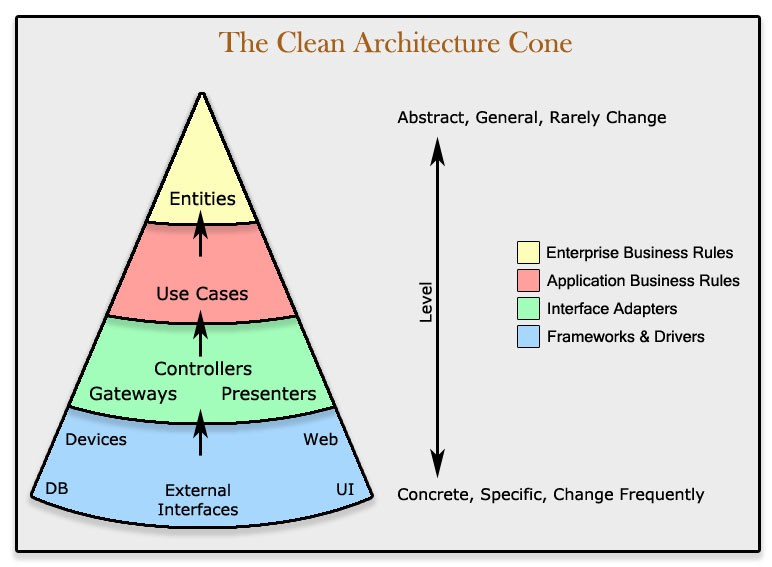

# api-clean-arch-bp

This boilerplate is structured using some of the concepts of clean architecture. Clean architecture principles help in developing software by providing a clear and organized structure that emphasizes separation of concerns, maintainability, and testability. By defining distinct layers such as entities, use cases, and adapters, Clean Architecture ensures that the core business logic remains decoupled from external frameworks and dependencies, allowing for easier modification and evolution of the system over time. This modular approach facilitates easier testing, as each component can be tested independently, leading to more reliable and robust software. Additionally, Clean Architecture promotes a focus on business requirements rather than technical details, resulting in software that is more aligned with the needs of its users and stakeholders. Overall, adhering to Clean Architecture principles fosters the development of software that is easier to understand, extend, and maintain throughout its lifecycle.

## General view of Clean Architecture Layers


## General view of Clean Architecture Layers - Abstraction Levels




## Folder Structure to Ensure the Separation of Concerns

```
project/
├── entities/
│   ├── [entity-name].ts         # Entity classes representing business objects
│   └── ...
├── adapters/
│   ├── controllers/             # Controllers for handling incoming requests
│   │   ├── [controller-name].ts
│   │   └── ...
│   └── ...
├── external/                    # External dependencies and integrations
│   ├── [external-library].ts
│   └── ...
├── main/                        # Main entry point of the application
│   ├── index.ts
│   └── ...
├── use-cases/                   # Use cases representing application-specific operations
│   ├── [use-case-name].ts
│   └── ...
├── tests/                       # Unit tests and integration tests
│   ├── [test-suite-name].test.ts
│   └── ...
└── shared/                      # Shared utilities and helpers
    ├── utils.ts
    └── ...
```

Explanation:
- `adapters/`: Adapters for interacting with external systems or frameworks.
  - `controllers/`: Controllers for handling incoming requests from the external world.
- `entities/`: Contains entity classes representing core business objects.
- `external/`: External dependencies and integrations, such as third-party libraries.
- `main/`: Contains the main entry point of the application.
- `shared/`: Shared utilities and helper functions used across the application.
- `tests/`: Contains unit tests and integration tests for the application.
- `use-cases/`: Use cases representing application-specific operations or business logic.